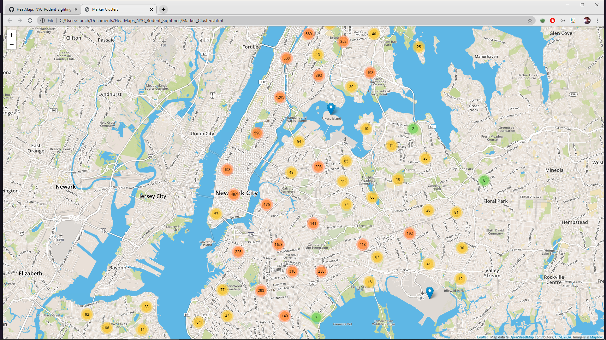

Rodent Sightings
https://ctrlaltafk.github.io/HeatMaps_NYC_Rodent_Sightings/Marker_Clusters

The rodent data for this project was taken from a json in opendata.cityofnewyork.us 
The map was created with openstreetmap.org It is zoomable and mobile responsive.
The heat markers were programmed with JavaScript and stylized with leaflet and CSS. If you hover over a cluster, it will outline the streets it’s representing. A blue marker means only 1 rodent has been recorded.

